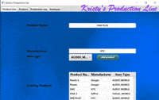

# ProductLineOOP
Software for a media player production facility that will keep track of what products are produced.  
I made this project independently for my Object Oriented Programming class from September-December 2019. 
It is a class project that applies the majority of the OOP concepts. This assignment allowed me to apply the concepts of interface, enumerations, recursion, and many more.
The Production Line project integrates GUI with database. For this program we used Java, JavaFX, and SQL H2 database.
It was a fun project to develop, it was my first time working with databases.

## Demonstration 
See AddProductButton_DEMO. 
See BETA_Demo.pdf 

## Documentation
[JavaDoc](https://github.com/krislowg/KProdLine_OOP/blob/master/docs/index.html)

Oracle
https://docs.oracle.com/javase/tutorial/java/IandI/subclasses.html
https://www.tutorialspoint.com/javafx/javafx_event_handling.htm
https://docs.microsoft.com/en-us/dotnet/api/system.data.entity.database.initialize?view=entity-framework-6.2.0

## Diagrams
See ProductDiagram.pdf and ProductRecordDiagram.pdf   

## Getting Started

## Built With Contributing 

## Author License

## Acknowledgments
Prof. Scott Vanselow
https://www.tutorialspoint.com/jdbc/jdbc-insert-records.htm
http://tutorials.jenkov.com/jdbc/preparedstatement.html
http://tutorials.jenkov.com/jdbc/query.html
https://stackoverflow.com/questions/42211063/how-to-populate-combobox
https://docs.oracle.com/javase/8/javafx/api/javafx/fxml/doc-files/introduction_to_fxml.html#controllers
Background Photo by James Owen on Unsplash
https://www.geeksforgeeks.org/
Classmates: Jackson Turner and Austin Nolz.
## History

## Key Programming Concepts Utilized**
Inheritance: A class that is derived from another class is called a subclass (also a derived class, extended class, or child class). The class from which the subclass is derived is called a superclass (also a base class or a parent class). 
Controller: a compiled class that implements the "code behind" the object hierarchy defined by the document. 
Event handler: the mechanism that controls the event and decides what should happen, if an event occurs.  
Exception handling:is a mechanism to handle runtime errors. 
Try/Catch: The try statement allows you to define a block of code to be tested for errors while it is being executed. 
The catch statement allows you to define a block of code to be executed, if an error occurs in the try block.  
Execute a query: using an object of type Statement for building and submitting an SQL statement to insert records into a table. 
DataBase initialize method:this method is typically used when it is necessary to ensure that the database has been created and seeded before starting some operation 

Beta
PreparedStatement:  is a special kind of Java JDBC Statement object with some useful additional features. 
Observable list: is a list that allows listeners to track changes when they occur. 
Enumerations: a list of named constant. 
Interface: is a completely "abstract class" that is used to group related methods with empty bodies 

